# Service Request Android App 📱

This Android application, developed in Java, allows users to place service requests (eg. plumbing) with selected service providers. The app features two sides: the **Customer** side and the **Provider** side, each utilizing its own Firebase Firestore database. To get started, download the APK file [here](https://github.com/atiqurx/service-request-system/blob/main/app/release/srs.apk) and run it on an Android device or emulator.

## 🚀 Features

### Customer Side (Login as Customer)

  
  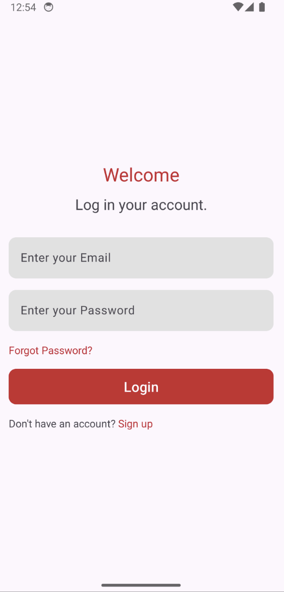
  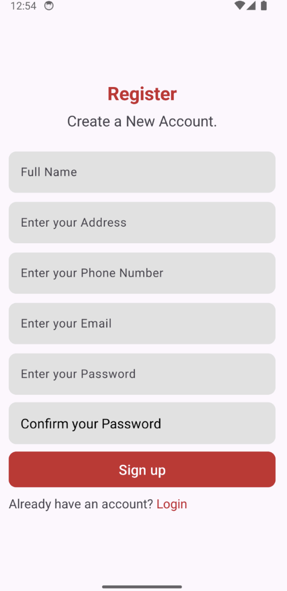

  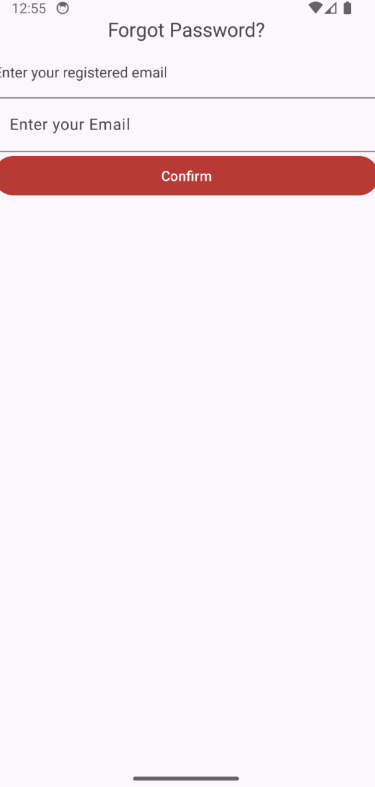
  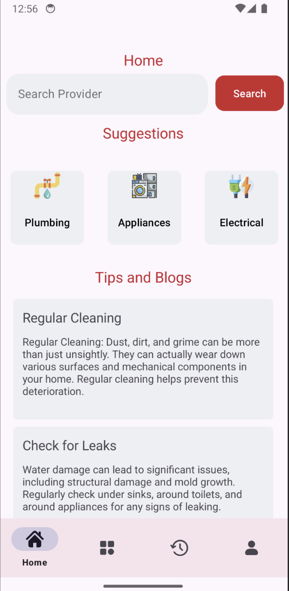
  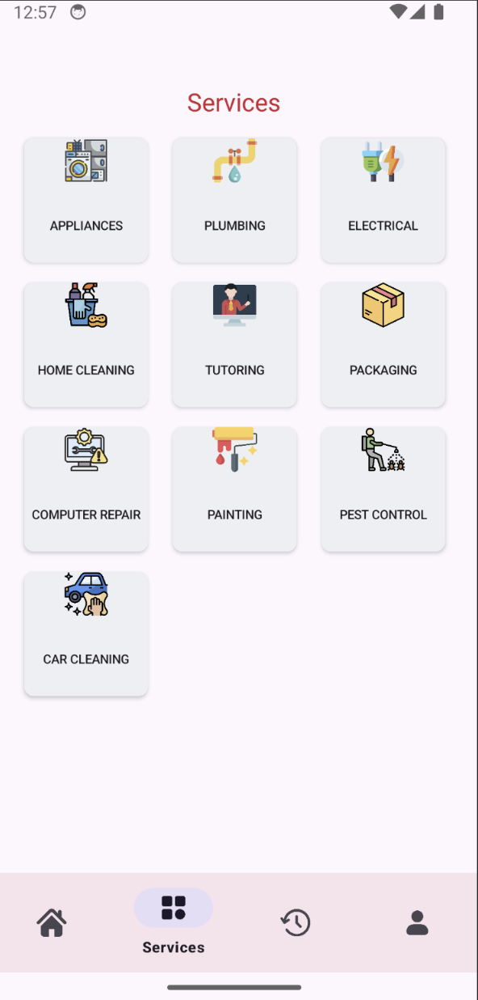

  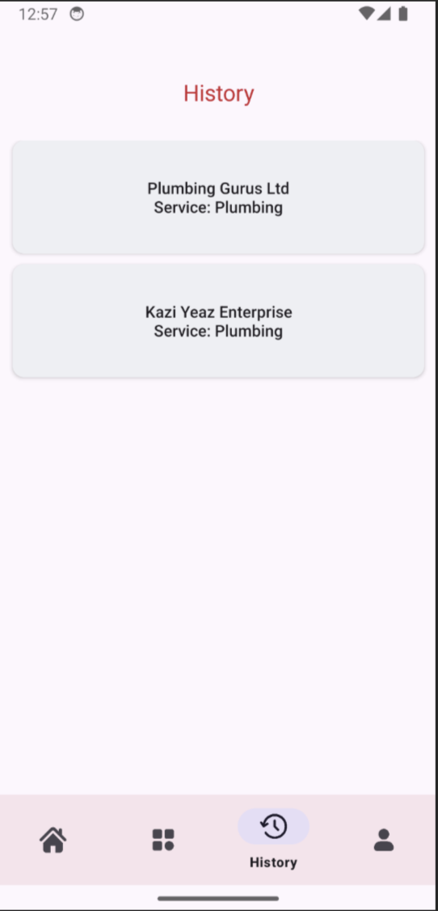
  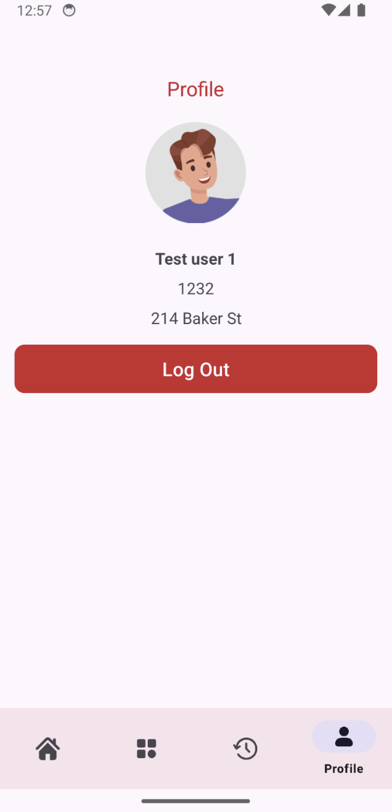
  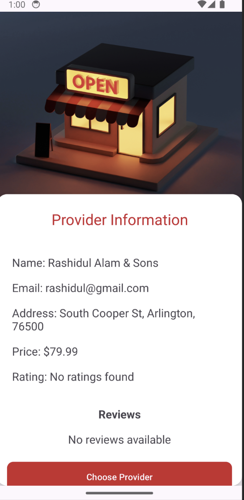

  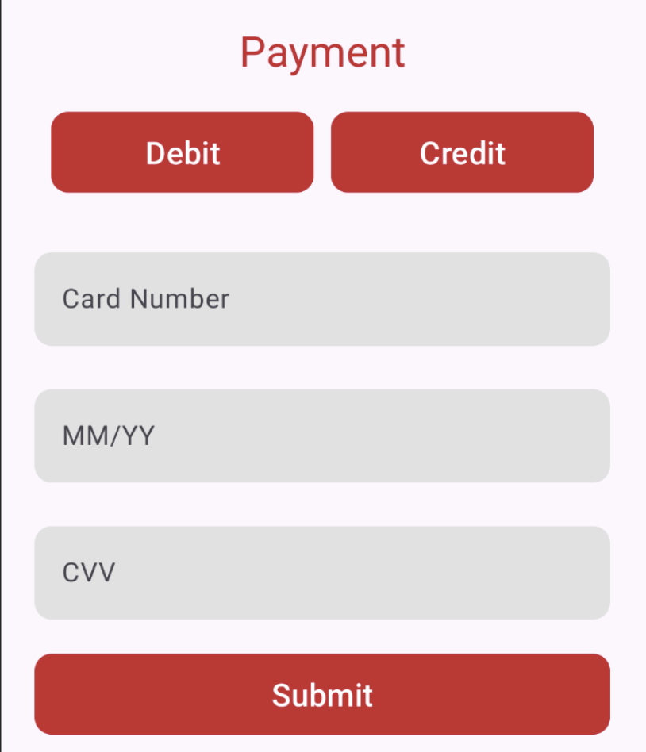
  

1. **User Authentication**: Secure login and registration using Firebase Authentication.
2. **Password Recovery**: Easily reset forgotten passwords using Firebase.
3. **Service Management**: Browse and request various services.
4. **History Tracking**: View past service requests and details.
5. **Profile Management**: Edit and update personal information.
6. **Provider Interaction**: View provider profiles and service details.
7. **Payments**: Only checks if card number has 16 digits and other fields are correct. Doesn't have a proper payment system.
8. **Rate & Review**: Provide feedback on services.

### Provider Side (Login as Provider)

  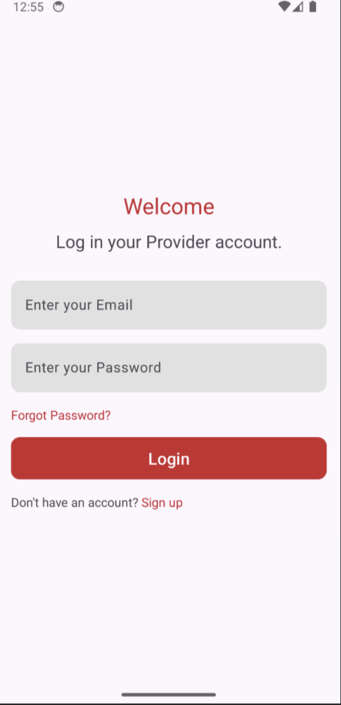
  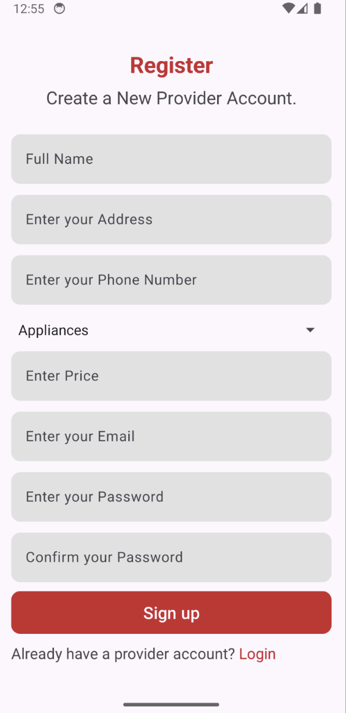
  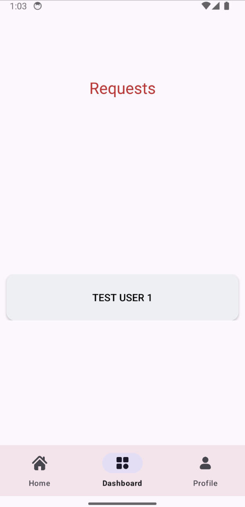

  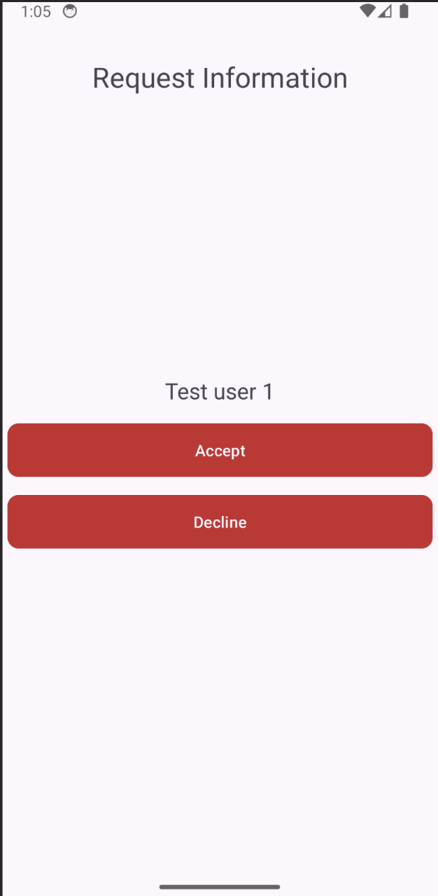
  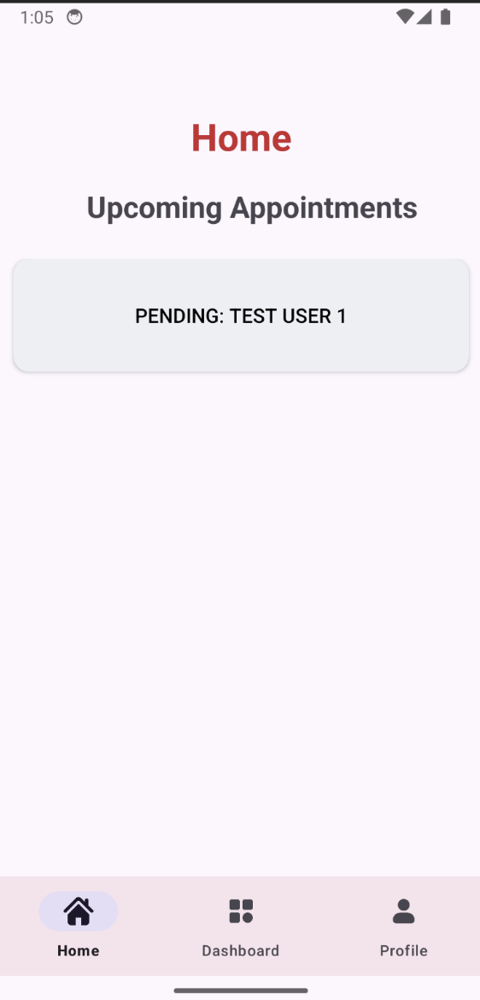

1. **Service Provider Authentication**: Secure login and registration for providers using Firebase Authentication.
2. **Dashboard Overview**: Manage and track incoming service requests using Firebase.
3. **Accept/Decline Requests**: Control over which service requests to accept.
4. **Profile & Service Management**: Manage offered services and personal details.

## 📲 Installation

1. **Download** the APK file from [here](#).
2. **Install** the app on your Android device or emulator.
3. **Login** as either a Customer or Provider to start using the app.
